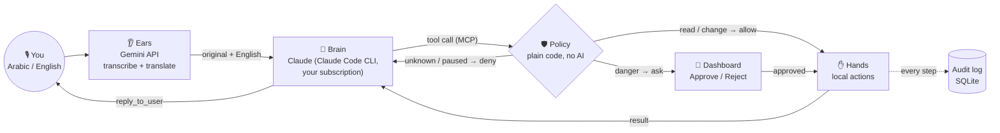
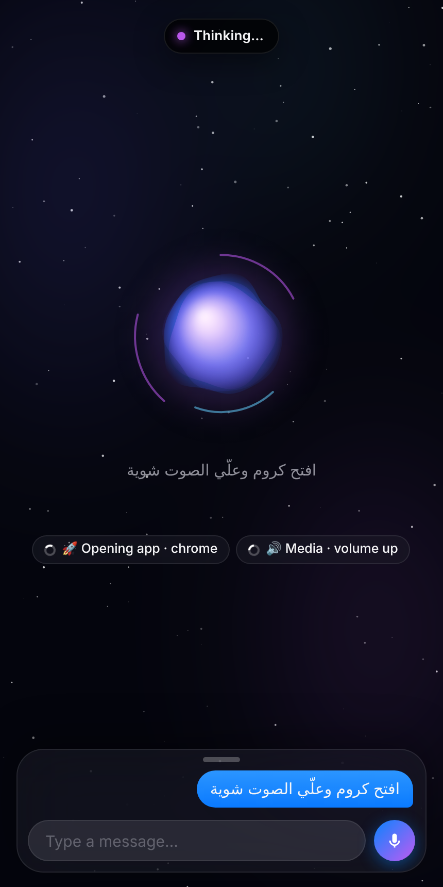
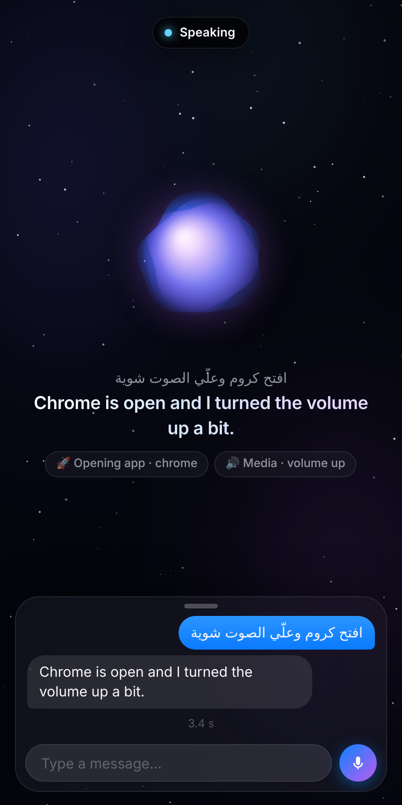
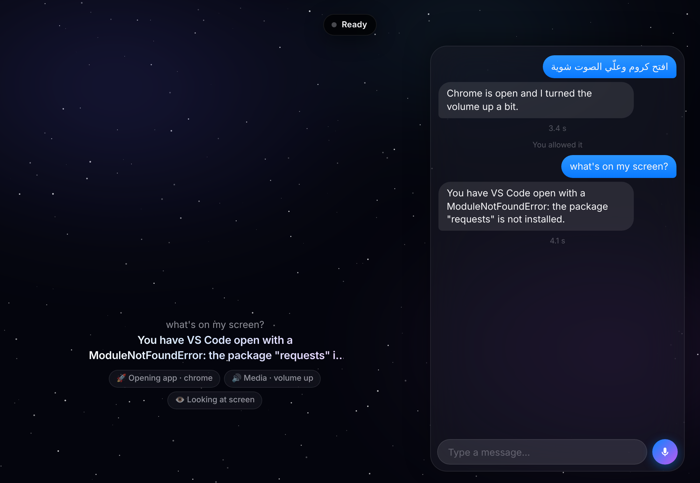

# Jarvis prototype: Gemini ears, Claude brain, gated hands

Speak to your laptop in Egyptian Arabic, Modern Standard Arabic or English.
**Gemini** transcribes and translates. **Claude** (through your Claude subscription, no API key) plans and verifies the task.
**Local hands** do the work, but only what a rule-based policy allows. Dangerous actions wait for you to tap **Approve** on a dashboard, from the laptop or your phone.



| Role | Who | Can it touch your laptop? |
|---|---|---|
| Ears | Gemini (`gemini-3.5-flash` + backups, configurable) | **No.** Text in, text out. |
| Brain | Claude | **Only** through the Jarvis tools. Built-in shell and file tools are disabled. |
| Policy | `jarvis/policy.py` | Decides. Unknown action → deny. Delete → human approval. Kill switch → reads only. |
| Hands | `jarvis/actions.py` | Paths are confined to allowed folders, apps come from an allowlist, and nothing runs through a shell. |

## Tested demo (real run, Claude as the brain)

The request: *"Check how much free disk space I have, then create a note called shopping with milk, bread and eggs, then delete my old note called draft, and confirm what is left in my notes folder."*

| Claude asks to delete → waits for you | Done (Claude verified the result) | Phone view |
|---|---|---|
|  |  |  |

The whole run took 23 s. Claude made 7 tool calls, and the delete waited until Approve was clicked. In an earlier run nobody clicked: the delete expired, Claude reported that nothing was deleted, and the file stayed.

## Setup on Windows

```powershell
# 1. Python 3.11+ and the project
cd jarvis
py -m venv .venv; .venv\Scripts\activate
pip install -e ".[mic,dev]"

# 2. Claude Code CLI (log in with your Claude Pro/Max account — no API key)
irm https://claude.ai/install.ps1 | iex   # native installer
claude          # first run opens the browser login; then exit

# 3. Gemini key (only needed for Arabic text or audio input)
setx GEMINI_API_KEY "your-key"     # open a new terminal afterwards

# 4. Run
python -m jarvis.doctor                          # checks every part, step by step
python -m jarvis.dashboard                       # open the printed link
python -m jarvis.bridge --text "افتح النوت باد"   # typed Arabic
python -m jarvis.bridge --mic 5                  # speak for 5 seconds
pytest                                           # 115 tests
```

### Jarvis mode: "Hey Jarvis" and spoken replies

```powershell
pip install -e ".[mic,wake,screen,ui]"                # once
python -m jarvis.assistant                            # say "Hey Jarvis", then speak
python -m jarvis.assistant --push-to-talk             # press Enter instead of the wake word
python -m jarvis.assistant --to print                 # test without Claude (repeats what it understood)
python -m jarvis.assistant --voice windows            # built-in Windows voice (default: natural Gemini voice)
```

- The wake word runs **offline** (openWakeWord, ready-made "Hey Jarvis" model). No audio leaves the laptop until it hears that phrase.
- High beep = speak now, low beep = stopped listening. Recording stops about 2 s after you finish talking (30 s maximum).
- If a Gemini model is slow or busy, Jarvis asks a backup model in parallel and uses whichever answers first. The winner is tried first next time.

### The Jarvis app

`python -m jarvis.assistant` opens the Jarvis window: a space-themed orb plus an iOS-style conversation panel. Tap the orb or say "Hey Jarvis" to talk, type in the box, and allow or deny actions from the sheet that slides up.

| Listening (reacts to your voice) | Thinking (actions as live chips) | Speaking | Approval |
|---|---|---|---|
|  |  |  |  |

On a wide window the conversation moves to the right: 

The window is a native window with `pip install -e ".[ui]"` (pywebview); otherwise it opens as an Edge/Chrome app window. Use `--no-ui` for console only.

**Screen awareness:** every request includes the title of the window in front. When you say "this" / "what's on my screen" / "reply to this", Jarvis takes a screenshot (`look_at_screen`, needs `.[screen]`) and Gemini answers from it. Screenshots go to Google only when this tool runs, and they're never kept in the conversation history.

### What Jarvis can do

By default Gemini (the "quick brain") does light tasks itself in a few seconds, and hands heavy ones to Claude.

| Say (Arabic or English) | Tool | Safety rule |
|---|---|---|
| "Open Chrome / VS Code / WhatsApp" | `open_app` | Only apps in your Start menu (or `apps.json`) |
| "Open YouTube", "Search Google for…" | `open_website`, `google_search` | http(s) only |
| "Summarize this page: …" | `read_web_page` | Public sites only (no local network); page text is treated as data |
| "Find my CV", "Open the Downloads folder" | `search_files`, `open_file_or_folder` | Documents, Desktop, Downloads and project folders; programs/scripts are never opened |
| "Write an email to … / a WhatsApp to …" | `draft_message` | Only **opens a draft**; you press Send |
| "Fix the bug in my project" | `code_task` | Claude edits files (no shell) in `JARVIS_CODE_DIRS`; **needs your approval** |
| "Delete …" | `delete_file` | **Needs your approval**; moved to trash |
| "Louder", "Mute", "Next song" | `media_control` | Media keys only |
| "Lock my laptop" | `lock_screen` | — |
| "What's open?", "Close Chrome" | `list_running_apps`, `close_app` | Closing **needs your approval**; it closes gracefully and never touches system processes |
| "Copy that", "What did I copy?" | `copy_to_clipboard`, `read_clipboard` | Clipboard text is treated as data |
| "Remind me in 20 minutes to…" | `set_reminder` | Saved in the database; fires even after a restart |
| "What's the news / price / weather…" | `search_web` | Google Search grounding; answers are treated as data |
| "I work as… / my project is…" (said naturally) | `remember`, `recall`, `forget` | Stays on your laptop (SQLite) |
| "Add a task…", "What's on my list?", "Log 200 EGP for lunch" | `db_add`, `db_find`, `db_update`, `db_delete` | Your personal database; deletes are soft |
| "Call me Abdelrahman", "Your name is Nova", "Use the Kore voice", "Answer in Arabic" | `set_preference` | Saved in `profile.json` |
| "Pause" / "Go to sleep", "Restart" | `go_to_sleep`, `restart_yourself` | — |
| "Improve yourself: add a…" | `improve_myself` | **Needs your approval**; see below |
| Anything complex | `ask_claude` | Claude, with the same tools |

When an approval is needed in voice mode, Jarvis asks out loud: press **Y** to allow or **N** to cancel, or use the dashboard.

### A personal assistant, not a command parser

- **Personality:** every turn Gemini gets a fresh persona prompt with your name, its name, what it remembers about you, your open items, upcoming reminders and the time. It chats, answers general questions from its own knowledge, and searches the web for anything current.
- **Memory:** when you mention something lasting (your work, projects, people, preferences), it saves it quietly and uses it later. Ask "what do you know about me?" or "forget that".
- **Proactive:** after helping, it may offer one short, relevant next step. A start-up briefing lists open and overdue tasks and the next reminder. A background check speaks due reminders and warns once about a low battery. Turn suggestions off with "stop making suggestions" (`proactive` off).
- **Voice:** the natural Gemini voice `Aoede` by default (`Kore`, `Leda`, `Zephyr`… also work). It starts speaking after the first sentence, and the orb follows the real loudness of the voice. If Gemini is over its quota, it switches to the Windows voice (female if installed) for 10 minutes.
- **Names:** the assistant's name changes everywhere, but the offline wake phrase stays **"Hey Jarvis"**: openWakeWord ships a model for that phrase only. A custom wake word needs a trained model.

### Self-improvement (`improve_myself`)

Say *"improve yourself: when I say 'focus mode', mute the volume and open my to-do list"*. After you approve:

1. The Jarvis folder must have no uncommitted changes (a clean point to return to).
2. Claude Code edits the code with file tools only (no shell), on your subscription.
3. Changes to the safety core (`policy.py`, `gateway.py`, `selfupdate.py`) are refused and undone.
4. The full test suite runs. If anything fails, every change is undone.
5. If tests pass, the change is committed **locally** (never pushed). Say "restart" to load it, and undo it with `git revert <commit>`.

`python -m jarvis.assistant` runs a small supervisor that starts the assistant again when you say "restart".

**Conversation mode:** say "Hey Jarvis" once. After each answer Jarvis keeps listening for a follow-up (`--follow-up 8` seconds), so you can keep talking ("now open it", "make it louder"). Stay quiet and it goes back to sleep.

**Speed and quota:** in quick mode your voice goes straight to Gemini, which understands and acts in the same request (no separate transcription step). If a model is busy or over its quota, Jarvis retries **that step** on another model. Actions that already ran are never repeated. Gemini's **free tier allows only a few requests per minute per model**, so for all-day use turn on billing for your key's project in AI Studio.

```powershell
python -m jarvis.assistant                 # quick brain (default)
python -m jarvis.assistant --to claude     # every request goes to Claude
python -m jarvis.bridge --text "open youtube"   # same, typed
```

### Use the same hands inside Claude Desktop (typing)

Run `python -m jarvis.bridge --print-desktop-config` and merge the output into `%APPDATA%\Claude\claude_desktop_config.json`. Then restart Claude Desktop. The same policy, approvals and audit log apply there too.

### Phone access

Install [Tailscale](https://tailscale.com) on the laptop and the phone. Start the dashboard with `python -m jarvis.dashboard --host 0.0.0.0` and open `http://<laptop-tailscale-ip>:8765/?token=…`. Never forward the port to the open internet.

## Configuration

| Variable / file | Default | Purpose |
|---|---|---|
| `JARVIS_HOME` | `~/.jarvis` | Database, workspace, trash, tokens |
| `JARVIS_ALLOWED_DIRS` | *(none)* | Extra folders the hands may access, separated by `;` |
| `JARVIS_HOME/apps.json` | notepad, calculator, … | Spoken name → executable allowlist |
| `JARVIS_GEMINI_MODEL` | `gemini-3.5-flash` | Ears model (tried first) |
| `JARVIS_GEMINI_FALLBACKS` | `gemini-3.5-flash-lite,gemini-3.8-flash` | Also asked in parallel if the first model is slow (>4 s) or busy; the fastest answer wins |
| `JARVIS_VOICE` | `gemini` | Spoken replies: `gemini` (voice from your profile), `windows` or `off` |
| `JARVIS_TTS_MODEL` | `gemini-3.8-flash-tts` | Gemini speech model |
| `JARVIS_THINKING` | `low` | Quick brain thinking level (`minimal` is faster, `medium` is smarter) |
| `JARVIS_HOME/profile.json` | Jarvis / Aoede / English | Your name, its name, voice, reply language (`english`, `arabic`, `same`), proactive. Change it by voice |
| `JARVIS_QUICK_MODEL` | `gemini-3.5-flash` | Gemini model that does light tasks itself |
| `JARVIS_CODE_DIRS` | `~/AbdelrahmanNafie`, `~/Projects`, `~/source/repos` (if they exist) | Folders Claude may edit for coding tasks (separate with `;`) |
| `JARVIS_USER_DIRS` | `1` | `0` limits Jarvis to its own workspace instead of Documents/Desktop/Downloads |
| `JARVIS_CLAUDE_MODEL` | `sonnet` | Brain model alias (`opus` is stronger but uses your plan's limit faster) |
| `JARVIS_APPROVAL_WAIT_S` | `45` | How long a dangerous action waits for your click |

## Design notes and limits

- **Why the Claude Code CLI and not the Claude Desktop window?** Claude Desktop has no supported way for another program to send it a message. The alternative is simulating keystrokes in its window, which breaks easily. The Claude Code CLI uses the same subscription login and accepts prompts from a script. Claude Desktop can still use the same hands when you type.
- **Gemini never acts.** Giving a second model control over the laptop would double the attack surface. Actions are plain code that Claude calls, and the policy checks every call.
- **Claude receives both the original speech and the English translation**, so nothing is lost when the translation misses a detail.
- **Usage:** every voice command is one Claude Code run and counts toward your plan's limits. A run starts in about 7–15 s, so this is not yet instant. Phase 2 adds a persistent session to cut that delay.
- **Deletes are recoverable.** Files move to `JARVIS_HOME/trash` and are not erased.
- File contents and tool results are treated as data. A prompt injection can still *propose* an action, but it still has to pass the same policy checks.
