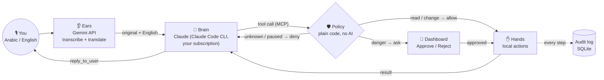
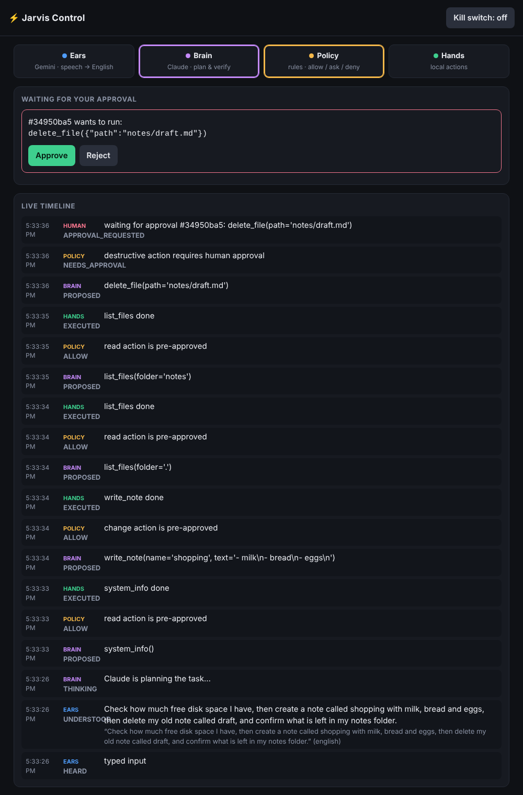
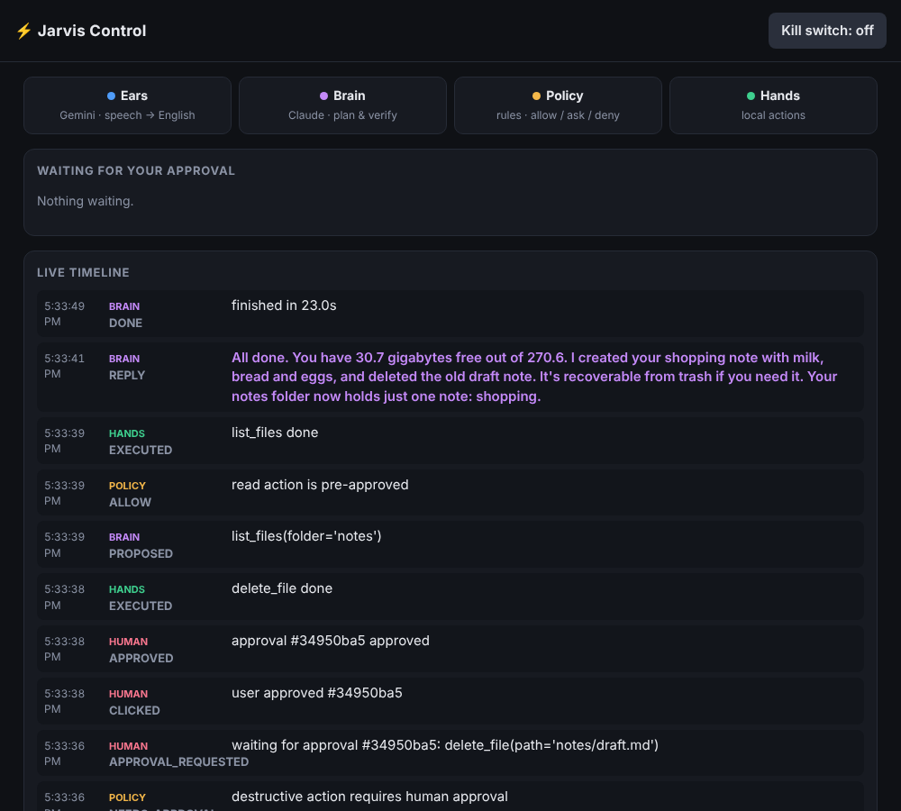
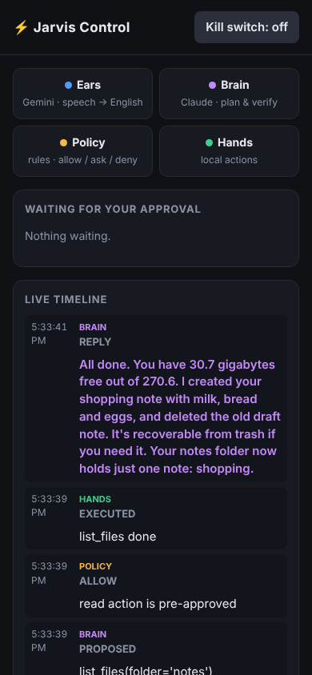

# Jarvis prototype: Gemini ears, Claude brain, gated hands

Speak to your laptop in Egyptian Arabic, Modern Standard Arabic or English.
**Gemini** transcribes and translates. **Claude** (through your Claude subscription, no API key) plans and verifies the task.
**Local hands** do the work, but only what a rule-based policy allows. Dangerous actions wait for you to tap **Approve** on a dashboard, from the laptop or your phone.



| Role | Who | Can it touch your laptop? |
|---|---|---|
| Ears | Gemini (`gemini-3.8-flash`, configurable) | **No.** Text in, text out. |
| Brain | Claude | **Only** through the 7 Jarvis tools. Built-in shell and file tools are disabled. |
| Policy | `jarvis/policy.py` | Decides. Unknown action → deny. Delete → human approval. Kill switch → reads only. |
| Hands | `jarvis/actions.py` | Paths are confined to allowed folders, apps come from an allowlist, and nothing runs through a shell. |

## Tested demo (real run, Claude as the brain)

The request: *"Check how much free disk space I have, then create a note called shopping with milk, bread and eggs, then delete my old note called draft, and confirm what is left in my notes folder."*

| Claude asks to delete → waits for you | Done (Claude verified the result) | Phone view |
|---|---|---|
|  |  |  |

The whole run took 23 s. Claude made 7 tool calls, and the delete waited until Approve was clicked. In an earlier run nobody clicked: the delete expired, Claude reported that nothing was deleted, and the file stayed.

## Setup on Windows

```powershell
# 1. Python 3.11+ and the project
cd jarvis
py -m venv .venv; .venv\Scripts\activate
pip install -e ".[mic,dev]"

# 2. Claude Code CLI (log in with your Claude Pro/Max account — no API key)
irm https://claude.ai/install.ps1 | iex   # native installer
claude          # first run opens the browser login; then exit

# 3. Gemini key (only needed for Arabic text or audio input)
setx GEMINI_API_KEY "your-key"     # open a new terminal afterwards

# 4. Run
python -m jarvis.doctor                          # checks every part, step by step
python -m jarvis.dashboard                       # open the printed link
python -m jarvis.bridge --text "افتح النوت باد"   # typed Arabic
python -m jarvis.bridge --mic 5                  # speak for 5 seconds
pytest                                           # 22 tests
```

### Use the same hands inside Claude Desktop (typing)

Run `python -m jarvis.bridge --print-desktop-config` and merge the output into `%APPDATA%\Claude\claude_desktop_config.json`. Then restart Claude Desktop. The same policy, approvals and audit log apply there too.

### Phone access

Install [Tailscale](https://tailscale.com) on the laptop and the phone. Start the dashboard with `python -m jarvis.dashboard --host 0.0.0.0` and open `http://<laptop-tailscale-ip>:8765/?token=…`. Never forward the port to the open internet.

## Configuration

| Variable / file | Default | Purpose |
|---|---|---|
| `JARVIS_HOME` | `~/.jarvis` | Database, workspace, trash, tokens |
| `JARVIS_ALLOWED_DIRS` | *(none)* | Extra folders the hands may access, separated by `;` |
| `JARVIS_HOME/apps.json` | notepad, calculator, … | Spoken name → executable allowlist |
| `JARVIS_GEMINI_MODEL` | `gemini-3.8-flash` | Ears model |
| `JARVIS_CLAUDE_MODEL` | `sonnet` | Brain model alias (`opus` is stronger but uses your plan's limit faster) |
| `JARVIS_APPROVAL_WAIT_S` | `45` | How long a dangerous action waits for your click |

## Design notes and limits

- **Why the Claude Code CLI and not the Claude Desktop window?** Claude Desktop has no supported way for another program to send it a message. The alternative is simulating keystrokes in its window, which breaks easily. The Claude Code CLI uses the same subscription login and accepts prompts from a script. Claude Desktop can still use the same hands when you type.
- **Gemini never acts.** Giving a second model control over the laptop would double the attack surface. Actions are plain code that Claude calls, and the policy checks every call.
- **Claude receives both the original speech and the English translation**, so nothing is lost when the translation misses a detail.
- **Usage:** every voice command is one Claude Code run and counts toward your plan's limits. A run starts in about 7–15 s, so this is not yet instant. Phase 2 adds a persistent session to cut that delay.
- **Deletes are recoverable.** Files move to `JARVIS_HOME/trash` and are not erased.
- File contents and tool results are treated as data. A prompt injection can still *propose* an action, but it still has to pass the same policy checks.
