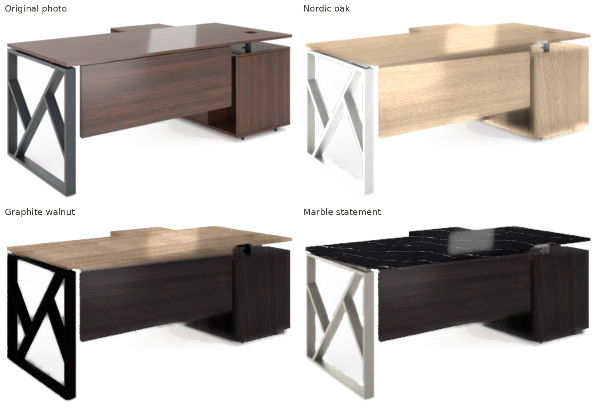
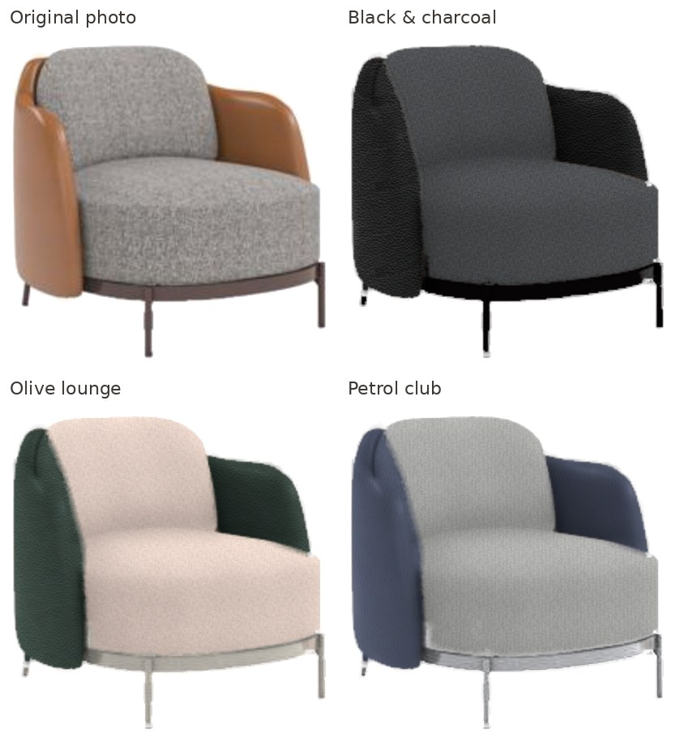
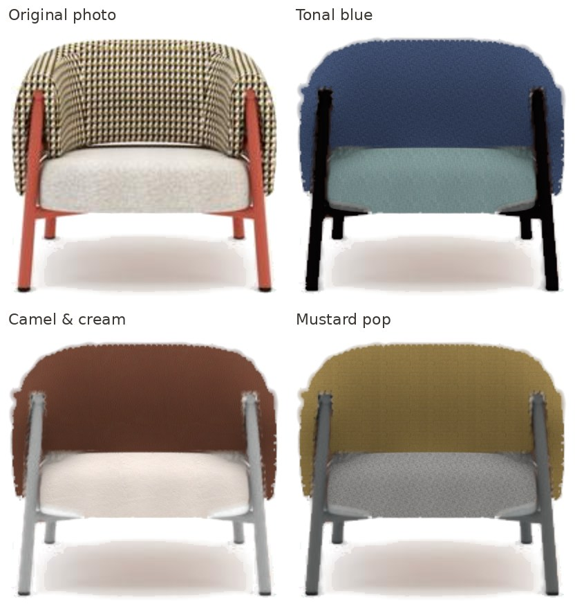
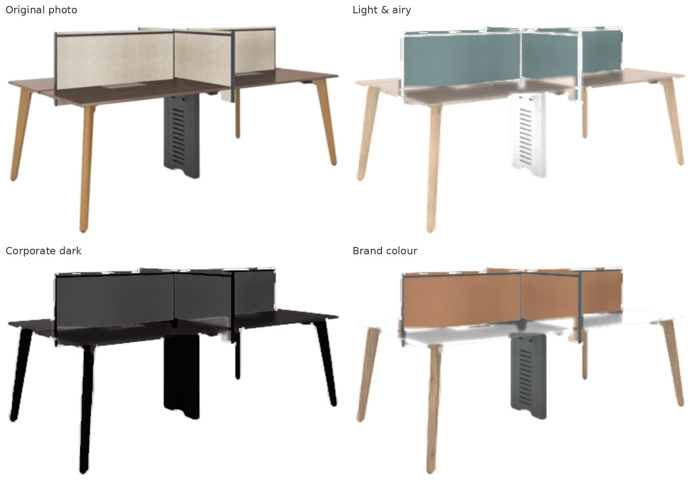

# Material Studio — photo-based product material configurator (demo)

Change the finishes of any furniture product **directly on its studio photo**, using the real
Mobica material library, and export a catalog/quotation-ready image with the material codes embedded.

Separate prototype — it does not touch the production system. 100 % client-side (static files),
no GPU server, no AI API calls, no per-image cost. Deployable as-is to Cloudflare Pages.

| Original vs. three presets (rendered by the app, exported at 2×) | |
|---|---|
|  |  |
|  |  |

---

## Run it

```bash
cd material-configurator
npm install
npm run dev          # http://localhost:5173
npm run build        # static site in dist/  (type-checks first)
npm run preview      # serve dist/ locally
```

Deploy to Cloudflare Pages: build command `npm run build`, output directory `dist`, root
`material-configurator`. There is no backend, so nothing else to configure.

## What you can do

1. **Pick a product** (4 demo products from the supplied photos) or **upload your own** (top bar, or drop a file anywhere).
2. **Click a part** on the photo (or in the left list). Parts that must always match (e.g. modesty panel + pedestal) are
   grouped and change together.
3. **Browse the finishes allowed for that part** — real Mobica codes, filtered by category, searchable by code/colour.
   **Hover a swatch to preview it live**, click to apply.
4. Compare: **Customised / Original / Split (draggable) / Side by side**, zoom 2×/4× (re-rendered, not just magnified).
5. **Presets**, **Closest-to-photo** (the catalog finish nearest to what the photo shows), **Reset**.
6. **Fidelity test** — re-renders every part with its closest catalog finish and measures the difference against the
   photo (colour ΔE heat-map + a lighting-preservation score).
7. **Export**: original framing 1×/2×/3×, catalog square 1200², Excel/quotation 400²; pure-white background (soft floor
   shadow kept); PNG with the full configuration **embedded in the file** (iTXt chunk) or JPG; configuration JSON;
   "Copy Excel row" (tab-separated: SKU, product, every code, file name); the file name itself carries the codes.
8. **Restore**: drop an exported PNG back onto the app → it switches to that product and re-applies its exact codes.
   The URL is also shareable (`#/product-id?group=material-id…`).

### Setting up a new product (≈1–2 minutes)

`Upload product` → the setup panel opens:

1. **Detect parts automatically** – choose 2–5 materials. K-means on texture-smoothed colour proposes parts and guesses
   each one's type (wood / fabric / leather / metal) from colour, texture, grain direction and thickness.
2. **Refine** – *Smart select* (click a surface; region-grows on pattern-smoothed colour and stops at edges; Shift-click
   removes), *Brush/Erase*, *Polygon*. The white backdrop and soft floor shadows can never be selected.
3. **Group** parts that change together, set which finish categories are allowed, set the real **width (cm)** of the
   product (gives textures their physical scale) and optionally a **perspective plane** (drag 4 corners onto a real
   rectangle such as a desktop) so grain follows the surface.
4. **Save** (stored in this browser, IndexedDB) or **Export spec** (JSON incl. masks — the format a product
   management system would store).

Mask edges are refined automatically (guided filter on the photo), so rough selections still give clean boundaries.

## How the rendering works (why it isn't a colour overlay)

For each customisable part the engine separates the photo into **lighting** and **material**, then re-lights the new
material with the photo's own lighting (`src/engine/renderer.ts`, `prepare.ts`):

| Step | What is preserved |
|---|---|
| Lighting map = photo luminance, smoothed *inside the part only* (normalised convolution) so the old grain/weave/pattern disappears but shading, AO and form stay | shape, shadows, depth |
| Fine-detail ratio (photo ÷ lighting)^k re-applied | seams, stitching, creases, edges |
| New albedo from the real swatch scan, made seamless, tiled at **physical scale** (product width in cm + swatch size), oriented by grain angle or a perspective homography | real grain, weave, leather pores, marble veins |
| Photographed highlights split off above a gloss-dependent knee and re-tinted by the new material's gloss / relief / metalness | glossy vs. matte, leather vs. fabric, chrome vs. powder coat |
| Edge-aware soft alpha; silhouette pixels re-composited over the local backdrop | clean edges, no halo of the old finish |
| Everything outside the parts is byte-identical to the photo | design, proportions, background, floor shadow |

Material behaviour comes from `render` parameters per material (`public/materials/materials.json`): fabric scatters light
(compressed highlights, sheen), leather keeps a broken satin sheen, laminate keeps reflections, powder-coat metals keep
highlights, Silver 9006 / Copper 8519-1 are metallic (tinted highlights), chrome is a high-contrast remap of the lighting.

Rendering runs on the GPU (WebGL2): switching a material is instant, and exports re-render at 2–3× with full-resolution
texture detail.

## Material library

`tools/build_materials.py` extracts every swatch from the supplied PDF (`Mobica Finishes 2024-II`) and keeps its
original **code, name, category and source page**: 31 fabrics, 5 natural leathers, 7 artificial leathers, 7 wood decors,
11 metal powder coats = **61 catalog finishes**. Each swatch is cropped, illumination-flattened, made seamless with a
min-cut quilting seam, band-equalised (so repeats never show stripes) and saved at 512² + a thumbnail.

The PDF's text is outlined (vector shapes), so codes cannot be read automatically; they live in
`tools/mobica_catalog.csv`. **To add a material**: add a row, re-run

```bash
python3 tools/build_materials.py path/to/Mobica_Finishes.pdf   # needs numpy, pillow, poppler-utils
```

Six **concept materials** (Carrara & Nero marble, brushed nickel, chrome, clear & frosted glass) are procedurally
generated to show stone/chrome/glass rendering. They are **not in the Mobica catalog** and are labelled so everywhere.

## Adding a product without the UI

A product is a JSON file in `public/products/` (listed in `index.json`) + its photo:
groups (what changes together, allowed categories), parts (regions = polygons with optional colour constraints, or
bitmap masks), mapping (planar angle or perspective quad + real size), optional render tuning and presets.
See the four demo files; the in-app *Export spec* produces the same format.

## Evaluation — answer to "can this work from ordinary 2D studio photos?"

**Yes, for the large majority of finish changes, with one photo per product and no per-combination rendering.**
Observed on the four supplied products (all automated checks in the e2e script were run headless):

* **Shape, shadows and highlights survive the swap.** The fidelity test's lighting score (correlation of shading
  between render and photo) is 0.89–1.00 on 13 of 14 parts (desk 0.96–0.99, tub chair 0.97–0.99, club chair shell/cushions
  0.98–1.00, workstation 0.89–0.92); the club chair's metal base is the outlier (0.57) because it is only a few pixels wide.
* **Material types are visibly different**, not just recoloured: oak grain vs. walnut vs. marble veins on the desk,
  black leather sheen vs. woven fabric on the club chair, brushed nickel vs. chrome vs. powder coat on the bases.
* **Colour ΔE vs. the photo is 4–23**, but this mostly measures the gap between the *catalog swatch scan* and the
  *finish as it appears in the CG studio render*: the swatches are scanned darker than the furniture appears in the photos.
  The engine shows each finish at its catalog brightness; a per-product exposure slider exists in *Fine-tune*.

### Known limitations (stated, not hidden)

* **Source resolution is the ceiling.** The supplied photos are 480 px with the product ~200 px wide and heavy JPEG
  compression; fabric weave and leather grain become sub-pixel. Exports above 1× re-render textures sharply but lighting
  and silhouettes are interpolated. **Use ≥2000 px studio photos (PNG or high-quality JPG) for catalog output.**
* **Dark → very light changes** (e.g. black frame → white) work, but deep original shadows stay deep; the *Shadow depth*
  slider compensates.
* **High-contrast original patterns** (houndstooth) need stronger pattern removal (pre-set on that demo); some fine fold
  detail is lost with it.
* **Glass** is rendered against the white studio backdrop — what is behind a real glass panel cannot be recovered from one
  photo. **Chrome** reflections are synthesised from the photo's lighting, not a real environment.
* Auto-detect is a starting point (colour/texture clustering, no ML model); expect 1–3 smart-select clicks of correction.
  A future upgrade is click-to-segment with a self-hosted SAM model (runs in the browser via ONNX; model files can be
  served from Cloudflare R2 — no recurring cost).
* Interior inter-reflections (e.g. a red seat tinting the frame) are not re-simulated.

## Project layout

```
material-configurator/
  public/materials/      61 catalog + 6 concept textures, thumbnails, materials.json
  public/products/       demo product photos + definitions
  src/engine/            imageOps (filters, colour), prepare (masks/lighting), renderer (WebGL2),
                         mapping (homography), segment (smart select, auto-detect), match (closest finish),
                         fidelity, exporter (PNG metadata, framing), session
  src/ui/                Stage (canvas, compare, editing tools), Library, Panels, SetupPanel, ExportDialog
  tools/                 build_materials.py, mobica_catalog.csv
  tests/e2e.mjs          headless smoke test of the whole workflow
```

## Smoke test

```bash
npm run build && npx vite preview --port 4173 &
CHROMIUM=/path/to/chromium node tests/e2e.mjs
```
Loads the app, applies a preset, runs the fidelity test, uploads a photo, auto-detects parts, exports a PNG and checks
that the material codes are embedded, then restores the configuration from that PNG.
